# AIBOS — Entity Relationship Diagram

```mermaid
erDiagram
    USER ||--o{ ORGANIZATION_MEMBER : "is member of"
    ORGANIZATION ||--o{ ORGANIZATION_MEMBER : "has"
    ORGANIZATION ||--o| SUBSCRIPTION : "has"
    PLAN ||--o{ SUBSCRIPTION : "subscribes"
    ORGANIZATION ||--o{ AGENT : "owns"
    ORGANIZATION ||--o{ KNOWLEDGE_BASE : "owns"
    ORGANIZATION ||--o{ CONVERSATION : "owns"
    ORGANIZATION ||--o{ TASK : "owns"
    ORGANIZATION ||--o{ INTEGRATION : "connects"
    ORGANIZATION ||--o{ WORKFLOW : "owns"
    ORGANIZATION ||--o{ USAGE_RECORD : "incurs"
    ORGANIZATION ||--o{ AUDIT_LOG : "produces"
    ORGANIZATION ||--o{ MEMORY : "stores"
    USER ||--o{ CONVERSATION : "starts"
    USER ||--o{ TASK : "assigned"
    USER ||--o{ AUDIT_LOG : "actor"
    USER ||--o{ AGENT : "creates"

    AGENT ||--o{ AGENT_VERSION : "has versions"
    AGENT ||--o| AGENT_VERSION : "deployed"
    AGENT ||--o{ AGENT_TOOL : "uses"
    AGENT ||--o{ AGENT_KNOWLEDGE : "reads"
    TOOL ||--o{ AGENT_TOOL : "attached to"
    TOOL ||--o{ TOOL_EXECUTION : "executes"
    KNOWLEDGE_BASE ||--o{ DOCUMENT : "contains"
    KNOWLEDGE_BASE ||--o{ AGENT_KNOWLEDGE : "attached to"
    DOCUMENT ||--o{ DOCUMENT_CHUNK : "split into"
    USER ||--o{ DOCUMENT : "uploads"

    CONVERSATION ||--o{ MESSAGE : "contains"
    AGENT ||--o{ CONVERSATION : "participates"
    MESSAGE ||--o{ TOOL_EXECUTION : "triggers"

    WORKFLOW ||--o{ WORKFLOW_NODE : "nodes"
    WORKFLOW ||--o{ WORKFLOW_EDGE : "edges"
    WORKFLOW ||--o{ WORKFLOW_RUN : "runs"
    WORKFLOW_NODE ||--o{ WORKFLOW_EDGE : "source"
    WORKFLOW_NODE ||--o{ WORKFLOW_EDGE : "target"
    AGENT ||--o{ WORKFLOW_NODE : "called by"
    WORKFLOW_RUN ||--o{ WORKFLOW_RUN_LOG : "logs"
    WORKFLOW_NODE ||--o{ WORKFLOW_RUN_LOG : "step"

    INTEGRATION ||--o{ INTEGRATION_CREDENTIAL : "stores"
    TOOL ||--o{ INTEGRATION : "may need"

    USER ||--o{ REFRESH_TOKEN : "owns"
    USER ||--o{ SESSION : "owns"
    USER ||--o{ NOTIFICATION : "receives"
```

## Cardinalities summary

| Relation | Cardinality | Notes |
|---|---|---|
| User ↔ Organization | N:N (via OrganizationMember) | A user can belong to many orgs |
| Organization ↔ Agent | 1:N | Tenant isolation |
| Agent ↔ AgentVersion | 1:N (1 deployed) | `deployedVersionId` points to active version |
| Agent ↔ Tool | N:N (via AgentTool) | Per-agent config override |
| Agent ↔ KnowledgeBase | N:N (via AgentKnowledge) | Per-agent KB attach |
| KnowledgeBase ↔ Document | 1:N | Soft-delete cascade via filter |
| Document ↔ DocumentChunk | 1:N | Embeddings stored in pgvector |
| Conversation ↔ Message | 1:N | Streaming messages |
| Message ↔ ToolExecution | 1:N | A message can trigger multiple tools |
| Workflow ↔ Node/Edge | 1:N | Graph stored in `definition` JSONB canonically + nodes/edges tables derived |
| WorkflowRun ↔ RunLog | 1:N | Per-step audit |
| Integration ↔ Credential | 1:N | Encrypted, per-secret |
| Tool ↔ Integration | N:1 (optional) | Some tools need integration credentials |

## Tenant-scoped tables (have `organization_id`)

All of the following must include `organization_id` and are protected by RLS:

- `organizations` (self)
- `agents`, `agent_versions`, `agent_tools`, `agent_knowledge`
- `knowledge_bases`, `documents`, `document_chunks`
- `conversations`, `messages`
- `tasks`
- `integrations`, `integration_credentials`
- `workflows`, `workflow_nodes`, `workflow_edges`, `workflow_runs`, `workflow_run_logs`
- `usage_records`
- `audit_logs`
- `memories`
- `notifications` (optional `organization_id`)

## Global tables (no `organization_id`)

- `users` (global identity, but org membership via `organization_members`)
- `plans` (catalog)
- `tools` (registry — `organization_id` nullable, `is_built_in` flag distinguishes global built-ins from org-defined clones)
